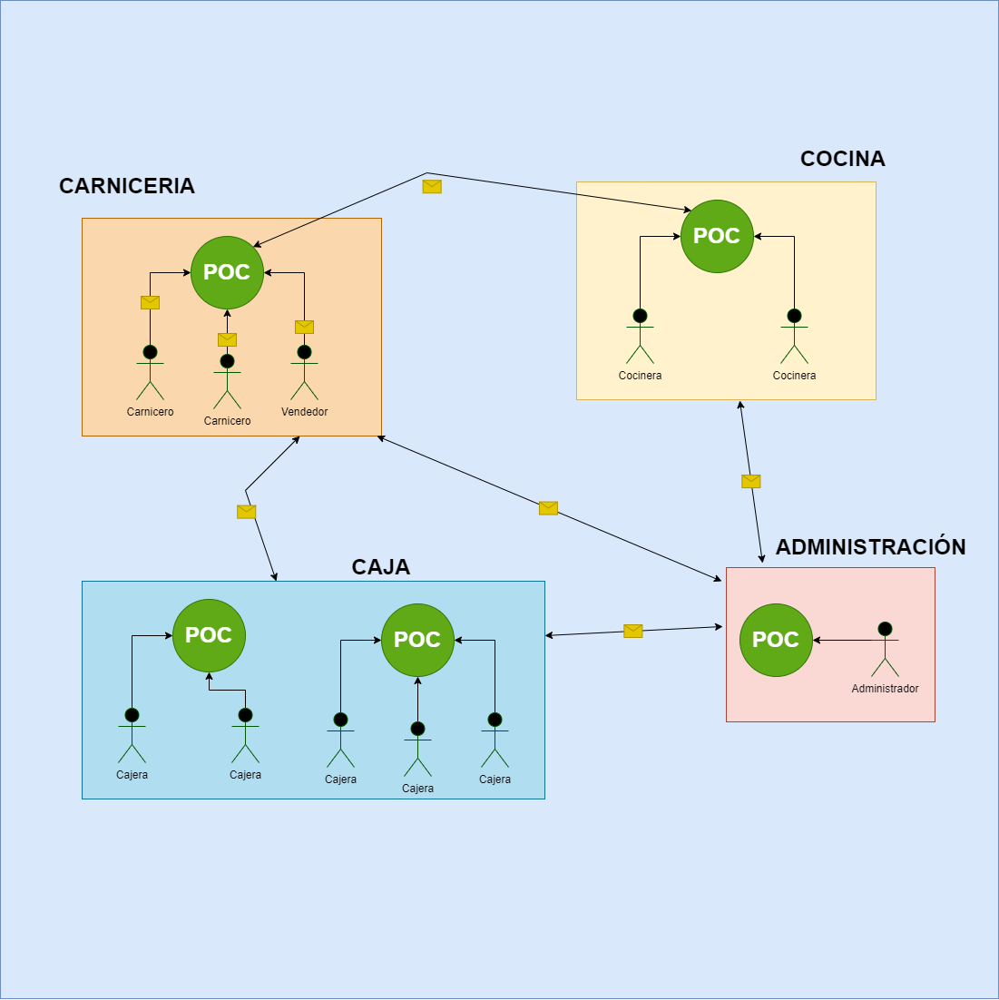

# __Sistema Coordinante de Actividades__

{ insertar diagrama ilustrativo }

## __Descripción:__

Una cadena de autoservicios tiene varias sucursales distribuidas por la ciudad donde cada sucursal tiene distintos sectores de trabajo como ser caja, balanza, cocina, carniceria, pnaderia, depósito y administración en donde varios empleados trabajan en cada sector. 
Se desea implementar un sistema gestor de actividades que ayude a administrar, controlar, trazar las tareas que se llevan a cabo en cada sector y entre sectores. Es decir, un sistema orquestador de actividades que facilite la traza de los procesos productivos del negocio y abra la comunicación entre los sectores.
Para esto se propone la instalación de un Punto de Contacto (POC) en cada sector, una máquina funcionalmente análoga a un Punto de Venta (POS), puede ser una computadora, una tableta o un celular, con la que los empleados interactúen durante su turno. 
Se pretende que los empleados, utilizando un POC, puedan abrir y cerrar su turno, operar su panel de control, recibir mensajes, tareas y notificaciones desde otros sectores y tomar acción sobre estos mensajes según sea requerido. 

## __Problema:__ 

Se desea implementar un sistema cliente/servidor en el que la pantalla principal de la aplicación cliente es la que tenga la lista de mensajes del sector. El panel de control de un empleado es una pantalla a la que el empleado puede navegar que le permite controlar información personal y completar documentos durante su turno a la que solo puede acceder con su clave de acceso. Estos documentos pueden ser formularios que se «concilian» al cerrar el turno de modo análogo como se hace un «cierre de caja» o un «arqueo de caja» en un Punto de Venta del sector Caja.

Los mensajes se intercambian entre empleados activos de los distintos sectores. Al enviar un mensaje se puede determinar, quienes pueden leer el mensaje y quienes lo pueden responder. Por ejemplo, un empleado de Carnicería podría mandar un mensaje a Cocina para que todos puedan leer el mensaje pero solo para que lo pueda accionar el Jefe de Producción de la Cocina o podría mandar un mensaje para que solo lo pueda leer y responder el Jefe de Producción. Esto indica que los etiquetados en el mensaje son los únicos responsables autorizados de «accionar el mensaje» ingresando una clave de acceso como firma. Accionar un mensaje o responder significa que el empleado debe llevar a cabo cierta acción sobre el mensaje dependiendo del tipo de mensaje, puede ser marcar una notificación como leída, responder un mensaje, marcar una tarea como realizada, rechazada, suspendida, en proceso, o rellenar un formulario. 

Cuando un empleado arriba al sector de trabajo listo para iniciar su jornada laboral debe iniciar sesión en un POC con su clave de acceso, el sistema considerará esta acción como el fichaje del empleado. Inmediatamente el empleado puede observar la lista de mensajes recibidos en la sección y se habilita un formulario en su panel de control en el que puede ir especificando cómo recibió su turno, esto es, de las tareas que deberían haberse hecho en el turno anterior, cuales se hicieron y cuáles no. 
Durante su turno, el empleado debe ir realizando sus tareas y respondiendo los mensajes, marcar tareas como realizadas, en realización, suspendidas, dar razones, enviar mensajes urgentes, marcar notificaciones como recibidas

## __Requerimientos funcionales:__

## __Requerimientos no funcionales:__

## __Actores:__

## __Casos de uso:__

{ insertar diagrama de casos de uso } 

## __Modelo del Dominio - Reglas del negocio__

  ### Diagramas de clases de diseño:
    { insetar diagrama de clases }
  ### Diagramas de secuencia
    { insertar diagrama de secuencia }

## __Arquitectura del software - capas -> Cliente - Servidor:__

  { insertar diagrama de la arquitectura }

